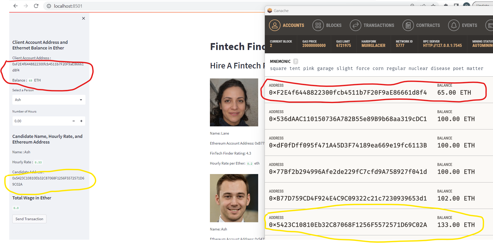
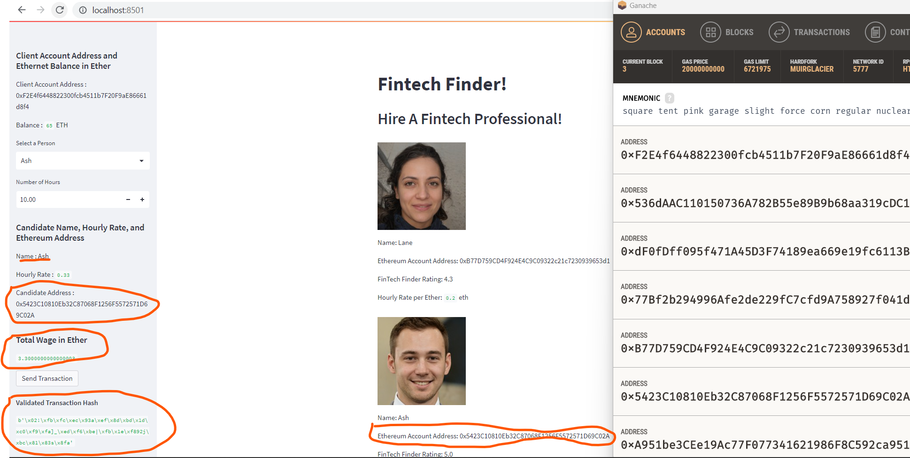
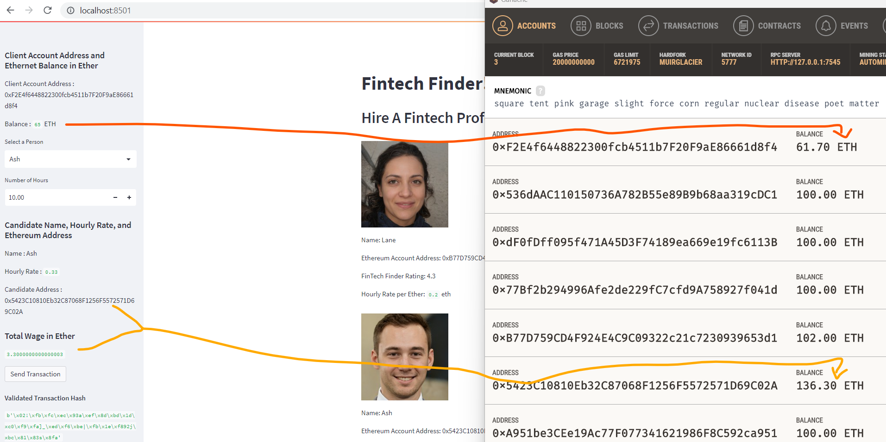

# Module 19
## Fintech Professional Finder

 
---
> Fintech Finder is an application that its customers can use to find fintech professionals from among a list of candidates, hire them, and pay them instantly.
---

The goal of the program is to achieve following:
* Write Ethereum transaction functions
* Write web interface of the applicatiom
* Integrate transaction functions and web interface

---

## Technologies

> Program uses Python 3.7.x version and Jupyter Lab
> Program uses libraries: bip44 (to work with Wallet), web3 (to work with ethereum account, gas strategy and related items),streamlit (to build web interface) and dataclasses (to create classes)

---

## Installation Guide 

Please install packages: Streamlit and Dataclasses using PIP Install {pkg}.

---

## Usage

Invoke the web interface as follows:

> streamlit run fintech_finder.py

---

## Results

> Initial state (before transaction)
(App's account balance is 65 ETH)

> Select Fintech Professional, hire him and pay him
(Ash was hired for 10 hours. That would cost approx. 3.3 ETH. Ash's prior balance was 133 ETH before this transaction.)

> Post transaction balances
(After Ash was hired and paid, the new balance would be 136.3 ETH = 133 ETH Prior balance + 3.3 ETH paid now)

---

## Contributors

Main author is : Pravin Patil. His linkedin profile is [Profile](https://www.linkedin.com/in/pravin-patil-5880301)

---

## License

Open
